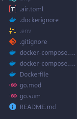

# Ejecución de la Aplicación

## Configuración del entorno

Antes de ejecutar la aplicación, es necesario que defina un archivo con las variables de entorno. Para ello puede basarse en el archivo de ejemplo:

```bash
cp resources/.env.example .env
```

Luego, debe editar `.env` y remplazar los valores por defecto con sus credenciales solicitadas.

> [!Tip] Las credenciales en el archivo `.env.example` ya están preparadas para que el programa funcione sin problemas. Por lo tanto, solo debe copiarlas en un archivo .env dentro de la carpeta principal.



## Ejecución

La aplicación cuenta con dos modos: el modo desarrollo y el modo producción.

### Modo Desarrollo

Este modo cuenta con la particularidad de que, además de utilizar una imagen que cuenta con las herramientas de Golang, se halla integrado Air, el cual permite que los cambios realizados en los archivos se reflejen automáticamente, lo que facilita el desarrollo.

Para iniciar la aplicación en este modo, debe ejecutar el siguiente comando:

```bash
docker compose up --build
```

### Modo Producción

Este modo se compone de una imagen liviana, compuesta únicamente de lo estrictamente necesario para correr la aplicación.

Para iniciar la aplicación en este modo, debe ejecutar el siguiente comando:

```bash
docker compose -f docker-compose.yml up -d --build
```

## Limpieza

Ante cambios en la base de datos, es necesario eliminar el volumen y reconstruirlo. Para ello, ejecute el siguiente comando:

```sh
docker compose down -v --rmi all
```

**También se recomiendo ejecutar el comando en caso de que no vaya a utilizar más la aplicación.**
